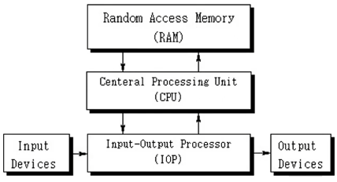
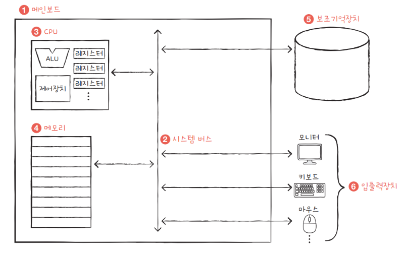
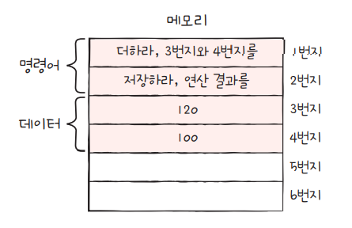
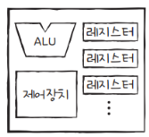
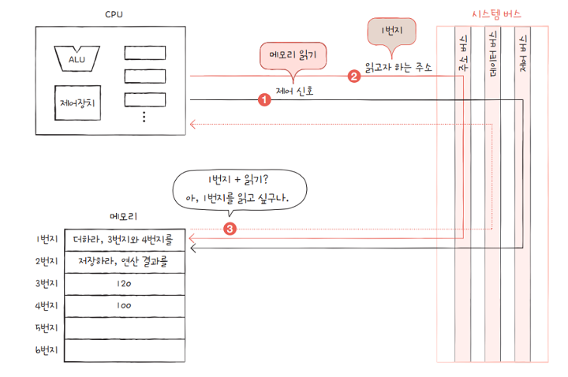

## 컴퓨터의 구성
### 컴퓨터 하드웨어

* 중앙 처리장치
  * Central Processing Unit : CPU
* 주변장치
  * main memory : RAM, ROM
  * secondary storage : HDD, SSD
  * IO devices : 마우스, 모니터

### 컴퓨터 소프트웨어
* 운영체제
* 시스템 소프트웨어
* 응용 소프트웨어

## 컴퓨터의 핵심 부품

* (1) 메인보드
* (2) 시스템버스
* (3) CPU
* (4) 메모리
* (5) 스토리지
* (6) 입출력장치

### Main Memory 메모리

* 메모리는 현재 실행되는 프로그램(프로세스)의 명령어와 데이터를 저장하는 부품
* 프로그램이 실행되려면 반드시 메모리에 저장되어 있어야 함
* 주소를 통해서 메모리에 저장된 값의 위치를 알고, 빠르고 효율적으로 접근
* RAM Random Access Memory, ROM Read Only Memory

### CPU

* CPU는 메모리에 저장된 명령어를 읽고, 해석하고, 실행하는 부품
* CPU의 구성 요소들 중 중요한 세 가지
  * ALU Arithmetic Logic Unit
  * register 레지스터
  * CU Control Unit 제어장치

#### ALU
* 계산을 위한 회로 모음 (계산기)
* 컴퓨터 내부에서 수행되는 대부분의 계산을 수행

#### Register 레지스터
* CPU 내부의 작은 임시 저장 장치
* 프로그램 실행에 필요한 값들을 임시로 저장
* CPU 에는 여러 개의 레지스터가 존재

#### Control Unit 제어장치
* 제어 신호를 보내고 명령어를 해석하는 장치
* 컴퓨터 부품들에게 보내는 전기 신호
  * 메모리 읽기
  * 메모리 쓰기

### Secondary Storage 보조기억장치
* 보조기억장치는 전원이 꺼저도 보관될 프로그램을 저장하는 부품
* 메모리의 경우 가격이 비싸 저장 용량이 적고, 전원이 꺼지면 정보가 휘발
* 그래서 메모리는 실행할 프로그램을 저장하고, 보조기억장치는 보관할 프로그램을 저장
* HDD, SSD, USB, DVD, CD 등

### Peripheral Device 입출력장치
* 입출력장치는 컴퓨터 외부와 연결되어 컴퓨터 내부와 정보를 교환할 수 있는 부품

### Main Board 메인보드 (Mother Board 마더보드)
* 메인보드는 컴퓨터의 부품들을 연결하는 보드
* 메인보드에 연결된 부품들은 버스를 통해서 정보를 주고 받음
* 다양한 종류의 버스가 있음

### System Bus 시스템 버스

* 시스템 버스는 컴퓨터 핵심 부품을 연결하여 정보를 주고 받는 통로
* address bus 주소 버스 : 주소를 주고 받는 통로
* data bus 데이터 버스 : 명령어와 데이터를 주고 받는 통로
* control bus 제어 버스 : 제어 신호를 주고 받는 통로

[참고](https://hongong.hanbit.co.kr/%EC%BB%B4%ED%93%A8%ED%84%B0%EC%9D%98-4%EA%B0%80%EC%A7%80-%ED%95%B5%EC%8B%AC-%EB%B6%80%ED%92%88cpu-%EB%A9%94%EB%AA%A8%EB%A6%AC-%EB%B3%B4%EC%A1%B0%EA%B8%B0%EC%96%B5%EC%9E%A5/)
