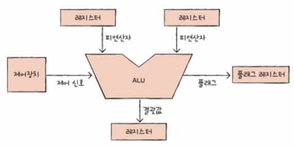
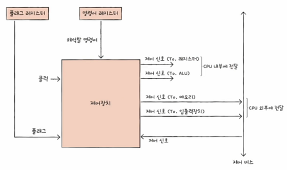
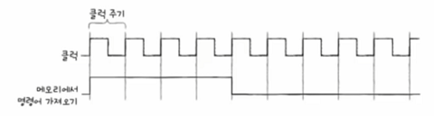

## ALU

* CPU에서 계산을 담당하는 장치
* 레지스터에서 피연산자를, 제어장치로부터 제어 신호(연산자)를 받아서
* 계산한 결과값을 레지스터에 저장
* CPU에서 레지스터에 접근하는 속도가 더 빠르기에, 메모리가 아닌 레지스터에 저장 후 다시 처리
* 플래그를 플래그 레지스터에 저장

### 플래그
* 연산 결과에 대한 부가 정보
* 대표적인 플래그의 종류

|플래그 종류|내용|
|:---:|:---|
|부호 플래그|연산한 결과의 부호|
|제로 플래그|연산한 결과가 0인지 아닌지|
|캐리 플래그|연산한 결과에 올림수나 빌림수가 발생했는지|
|오버플로우 플래그|오버플로우가 발생했는지|
|인터럽트 플래그|인터럽트가 가능한지|
|슈퍼바이저 플래그|커널 모드인지 사용자 모드 인지|

## 제어장치

* 제어 신호를 발생시키고 명령어를 해석하는 장치

### 받아들이는 정보
#### 클럭

* 순차 회로의 전기적 진동
* 컴퓨터 부품들의 시간 단위
* **컴퓨터의 연산 작업 처리 속도**

#### 명령어
* 명령어 레지스터로부터 해석할 명령어를 받음

#### 플래그
* 플래그 레지스터로부터 명령어의 부가 정보인 플래그를 받음

#### 제어 신호
* 외부로부터 발생한 제어신호를 제어 버스를 통해 받음

### 내보내는 정보
#### 제어 신호
* CPU 내부로 전달하는 제어 신호
  * 레지스터
  * ALU
* 제어 버스를 통해 CPU 외부로 전달하는 제어 신호
  * 메모리
  * 입출력 장치

## 레지스터
* CPU 내부의 임시저장장치
* 프로그램의 명령어와 데이터를 실행 전후로 레지스터에 저장
* CPU 종류마다 레지스터 종류가 다름
* 그 중 공통적으로 사용되는 레지스터 정리
  * 프로그램 카운터
  * 명령어 레지스터
  * 메모리 주소 레지스터
  * 메모리 버퍼 레지스터
  * 플래그 레지스터
  * 범용 레지스터
  * 스택 포인터
  * 베이스 레지스터

#### 프로그램 카운터
* 메모리에서 가져올(읽어 들일) 명령어의 주소
* Instruction Pointer 라고도 함

#### 명령어 레지스터
* 해석할 명령어
* 방금 메모리에서 읽어 들인 명령어

#### 메모리 주소 레지스터
* 메모리 주소
* CPU가 읽어들이고자 하는 주소를 주소 버스로 보낼 때 거치는 레지스터

#### 메모리 버퍼 레지스터
* 메모리와 주소받을 값, 데이터와 명령어
* CPU가 정보를 데이터 버스를 통해 주고 받을 때 거치는 레지스터

#### 플래그 레지스터
* 연산 결과 또는 CPU 상태에 대한 부가적인 정보

#### 범용 레지스터
* 다양하고 일반적인 상황에서 자유롭게 사용

#### 스택 포인터
* 스택의 꼭대기를 가리키는 레지스터
* 스택이 어디까지 차 있는지 표시
* 스택 주소 지정 방식에 사용
  * 스택과 스택 포인터를 이용한 주소 지정 방식

#### 베이스 레지스터
* 기준이 되는 주소를 저장하는 레지스터
* 변위 주소 지정 방식에 사용
  * 오퍼랜드 필드 값(변위)과 특정 레지스터(베이스 레지스터)의 값을 더하여 유효 주소 지정
  * 베이스 레지스터로부터 오퍼랜드 필드 값만큼 떨어진 주소의 코드 실행

