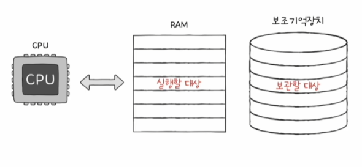

## RAM

* 메인 메모리
* 실행할 프로그램을 저장
* 전원이 꺼지면 정보가 사라지는 휘발성 저장 장치
* 보관할 프로그램은 비휘발성 저장 장치인 보조기억장치에 저장
* RAM의 용량이 크면 많은 프로그램들을 동시에 실행하는 데에 유리

## RAM의 종류

||DRAM|SRAM|
|:---:|:---:|:---:|
|재충전|필요|필요x|
|속도|느림|빠름|
|가격|저렴함|비쌈|
|집적도|높음|낮음|
|소비 전력|낮음|높음|
|사용 용도|RAM|캐시 메모리|

### DRAM
* Dynamic RAM
* 저장된 데이터가 동적으로 사라지는 RAM
* 데이터 소멸을 막기 위해 주기적으로 재활성화 필요
* 일반적으로 메모리로 사용되는 RAM
* 소비전력이 낮고, 가격이 저렴하고, 집적도가 높아 대용량으로 설계하기 용이

### SRAM
* Static RAM
* 저장된 데이터가 정적으로 사라지지 않는 RAM
* DRAM 보다 일반적으로 더 빠름
* 일반적으로 캐시 메모리에서 사용되는 RAM
* 대용량으로 설계할 필요는 없으나 빨라야하는 장치에 사용

### SDRAM
* Synchronous DRAM
* 클럭 신호와 동기화된 DRAM
* 클럭 신호에 맞춰서 데이터를 주고 받음

### DDR SDRAM
* Double Date Rate SDRAM
* 최근 가장 대중적으로 사용하는 RAM
* 대역폭을 넓혀 속도를 빠르게 만든 SDRAM
  * 대역폭 : 데이터를 주고받는 길의 너비
* SDR SDRAM -> DDR SDRAM -> DDR2 SDRAM -> DDR3 SDRAM -> DDR4 SDRAM
  * 대역폭이 두 배씩 커짐