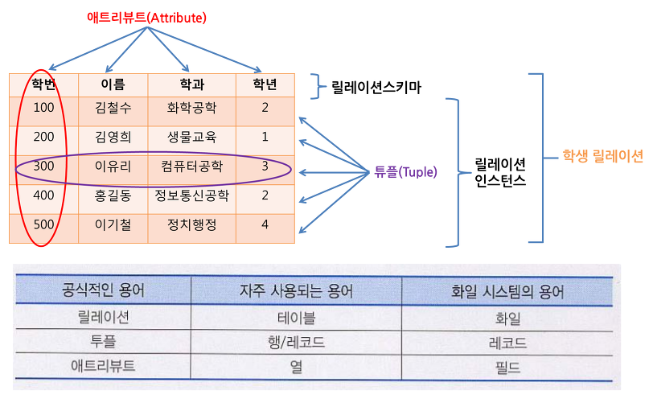
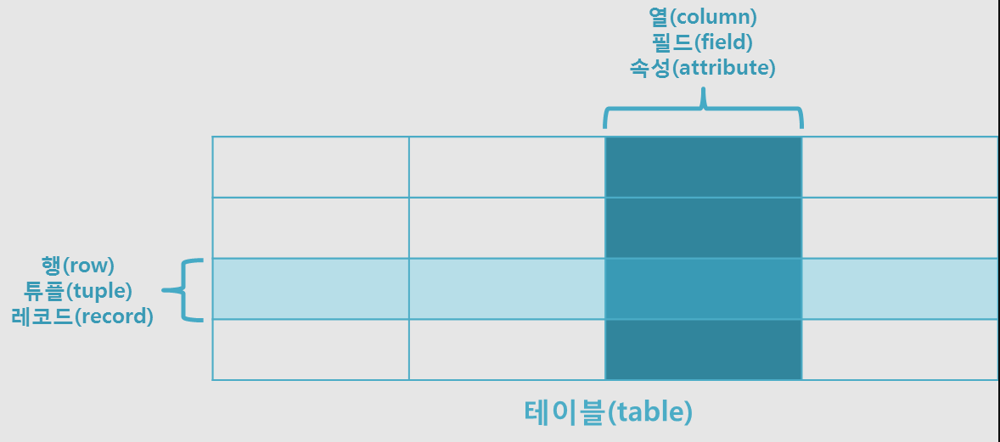
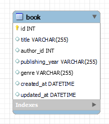
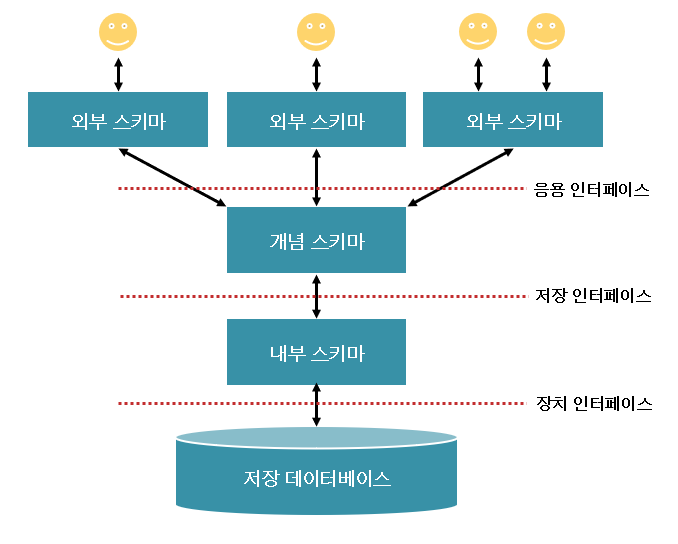

## 데이터베이스
* DB는 일정한 규칙을 통해 구조화되어 저장되는 데이터 모음
* DB를 제어 관리하는 시스템을 DBMS DataBase Management System
* DBMS마다 쿼리 언어를 통해 삽입, 조회, 수정, 삭제 가능



### Entity 엔티티
* 여러 개의 속성을 지닌 명사
* 사람, 장소, 사물, 사건 등과 같이 독립적으로 존재하면서 고유하게 식별 가능한 객체
* ex) 회원이라는 엔티티는 이름 아이디 전화번호 라는 속성을 가질 수 있다.
* A가 B의 존재 여부에 따라 종속적인 경우, A는 약한 엔티티 B는 강한 엔티티
  
### Relation 릴레이션
* 데이터베이스에서 정보를 구분하여 저장하는 기본 단위
* 관계형 데이터베이스에서는 '테이블'
* NoSQL 데이터베이스에서는 '컬렉션'

### Attribute 속성
* 릴레이션에서 관리하는 구체적이고 고유한 이름을 가지는 정보
* ex) 회원이라는 엔티티는 이름 아이디 전화번호 라는 속성을 가질 수 있다.

### Domain 도메인
* 릴레이션에 포함된 각각의 속성들이 가질 수 있는 값의 집합
* ex) 성별이라는 속성은 {남, 여}집합이 도메인이 된다.

### 필드와 레코드


### 차수
* 한 릴레이션(테이블)에 들어 있는 속성의 수
* 유효한 릴레이션의 최소 차수는 1
* 릴레이션의 차수는 자주 바뀌지 않음

### Cardinality 카디널리티
* 튜플의 수
* 데이터베이스 테이블간의 관계
* 데이터베이스 칼럼에 있는 고유한 값의 개수 

### 테이블 예시!
```SQL
CREATE TABLE book(
    id INT NOT NULL AUTO_INCREMENT,
    title VARCHAR(255),
    author_id INT,
    publishing_year VARCHAR(255),
    genre VARCHAR(255),
    created_at DATETIME,
    updated_at DATETIME,
    PRIMARY KEY (id)
);
```



### 필드 타입
#### 숫자타입
* TINYINT, SMALLINT, MEDIUMINT, INT, BIGINT, FLOAT, DOUBLE, DECIMAL

|데이터 타입|바이트 수|숫자 범위|
|:---|:---:|:---:|
|TINYINT|1|-128 ~ 127|
|SMALLINT|2|-32768 ~ 32767|
|MEDIUMINT|3|-8388608 ~ 8388607|
|INT|4|약 -21억 ~ 21억|
|BIGINT|8|약 -900경 ~ 900경|
|FLOAT|4|-3.40E+38 ~ -1.17E-38|
|DOUBLE|8|1.22E-308 ~ 1.79E+308|
|DECIMAL, NUMERIC|5 ~ 17|-1038+1 ~ +1038-1|

#### 문자타입
* CHAR, VARCHAR, TEXT, BLOB, ENUM, SET
* CHAR
  * 선언할때의 길이 값으로 고정되어 저장
  * 유동적이지 않은 길이를 가진 데이터 저장에 효율적
* VARCHAR
  * 가변 길이 문자열
  * 유동적인 길이를 가지는 데이터 저장에 유리
* TEXT
  * 큰 문자열 저장에 사용
  * 게시판 본문 저장
* BLOB 
  * 이미지, 동영상 등 큰 데이터 저장에 사용
  * 하지만 이미지나 동영상은 보통 AWS S3에 저장하고,
  * 파일 경로만 DB에 VARCHAR로 저장
* ENUM
  * 특정한 값 목록 중 하나를 선택할 수 있는 열 정의
  * 정의된 값 목록 중 하나만 포함해야 함
```sql
CREATE TABLE example (
    day ENUM('Monday', 'Tuesday', 'Wednesday', 'Thursday', 'Friday', 'Saturday', 'Sunday')
);
```
* SET
  * 여러 개의 데이터를 선택
  * 비트 단위의 연산
```sql
CREATE TABLE user_interests (
    interests SET('Music', 'Movies', 'Sports', 'Travel')
);
```
* ENUM 이나 SET 을 사용할 경우 공간적으로 이점을 볼 수 있지만,
* 값의 변경이나 추가가 발생할 경우 스키마를 변경해야 함

#### 날짜타입
* DATE, TIME, DATETIME, TIMESTAMP, YEAR

|데이터 타입|바이트 수|설명|
|:---|:---:|:---|
|DATE|3|YYYY-MM-DD|
|TIME|3|HH:MM:ss|
|DATETIME|8|YYYY-MM-DD HH:MM:SS|
|TIMESTAMP|4|YYYY-MM-DD HH:MM:SS (UTC)|
|YEAR|1|YYYY|

#### 기타타입
* GEOMETRY : 공간 데이터
* JSON : JSON 문서

### 스키마
* 데이터베이스의 구조(개채, 속성, 관계)와 제약 조건에 대한 정의
* DBMS는 스키마를 참조하여 사용자의 명령 수행



### 외부스키마 (사용자 뷰)
* 사용자나 프로그래머가 개인의 입장에서 필요로 하는 데이터베이스의 논리적 구조
* 전체 데이터베이스의 한 논리적인 부분으로 서브 스키마라고도 함
* SQL을 통하여 DB를 쉽게 사용

### 개념스키마 (전체적인 뷰)
* 모든 응용 프로그램이나 사용자들이 필요로 하는 데이터를 종합한 전체 데이터베이스
* 개체간의 관계와 제약조건을 나타내고, 데이터베이스의 접근 권한, 보안 및 무결성 규칙에 관해 정의
* 단순히 스키마라고 하면 보통 개념 스키마 의미
* DBA에 의해 구성

### 내부스키마 (저장 스키마)
* 물리적인 저장장치의 입장에서 본 데이터베이스 구조
* 실제로 데이터베이스에 저장될 레코드의 물리적인 구조를 정의
* 저장 데이터 항목의 표현 방법
* 내부 레코드의 물리적 순서
* 시스템 설계자가 보는 관점의 스키마

