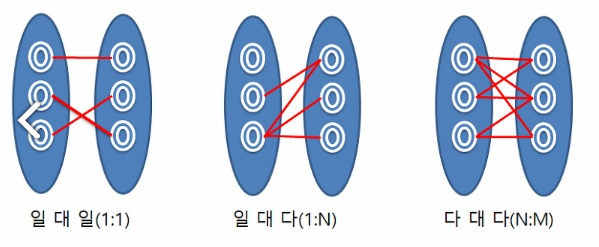
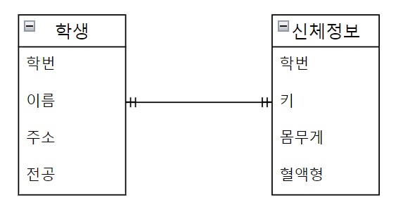
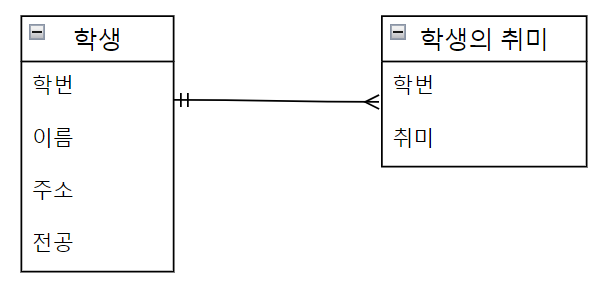
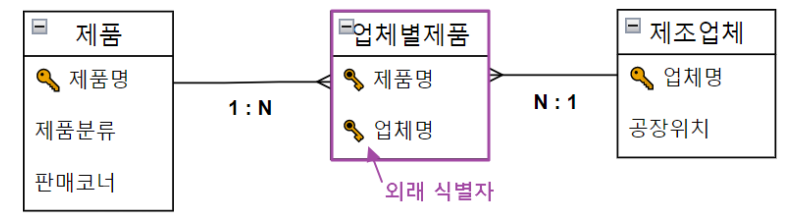
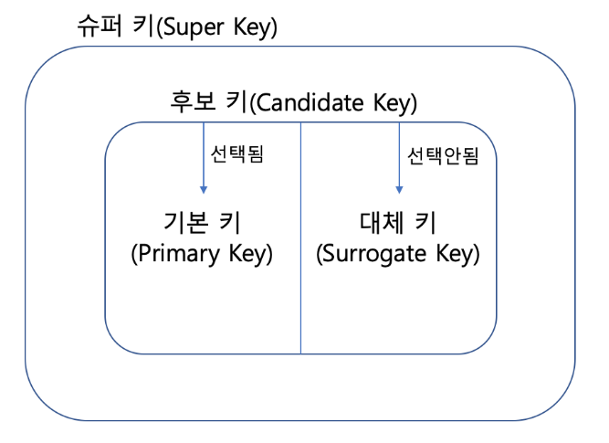

## 관계
* 엔티티간의 관계 또는 속성간의 관계
* 

### 1:1 관계
* 개체 집합 A의 각 원소가 개체 집합 B의 원소와 대응하는 관계

### 1:N 관계
* 한 개체가 다른 많은 개체를 포함하는 관계
* ex) 장바구니예시 : 유저 - 상품

### M:N 관계
* 개체 집합 A의 각 원소는 개체 집합 B의 원소 여러개와 대응, 반대로도 여러개와 대응
* ex) 학생 - 강의

* 데이터 모델링에서는 M:N 관계를 1:N, N:1 로 조정하는 작업

## 키

* 테이블간의 관계를 명확하게 하고 테이블 자체의 인덱스를 위해 설정된 장치
* 기본키, 외래키, 후보키, 슈퍼키, 대체키
* 유일성 : 중복되는 값이 없음
* 최소성 : 필드를 조합하지 않고 최소 필드만 써서 키를 형상 할 수 있음

### 기본키
* PK Primary Key
* 유일성, 최소성을 만족하는 키
* 일반적으로는 인조키로 설정

#### 자연키
* 예를 들어 유저 테이블이 있을 때
* 주민등록번호는 중복없는 고유한 값으로 기본키로 사용 -> 자연키

#### 인조키
* 예를 들어 유저 테이블이 있을 때
* 인위적으로 user_id 를 부여하여 기본키로 사용 -> 인조키
* 주로 auto increment로 설정

### 외래키
* FK Foreign Key
* 다른 테이블의 기본키를 그대로 참조하는 값
* 개체와의 관계를 식별하는데 사용

### 후보키
* 후보키는 기본키가 될 수 있는 후보들
* 유일성, 최소성 만족
* ex) 유저테이블의 pk(인조키), 주민등록번호

### 대체키
* 후보키가 두 개 이상일 경우, 선택된 기본키를 제외하고 남은 후보키
* ex) 유저테이블의 후보키 중에서 선택되지 않은 주민등록번호

### 슈퍼키
* 각 레코드를 유일하게 식별할 수 있는 유일성을 갖춘 키
* ex) {학번+이름} 처럼 속성을 묶어서 중복없이 구별가능하면 슈퍼키로 사용 가능