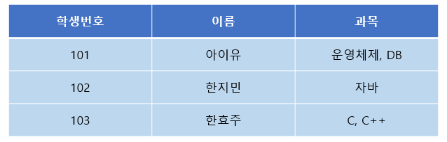
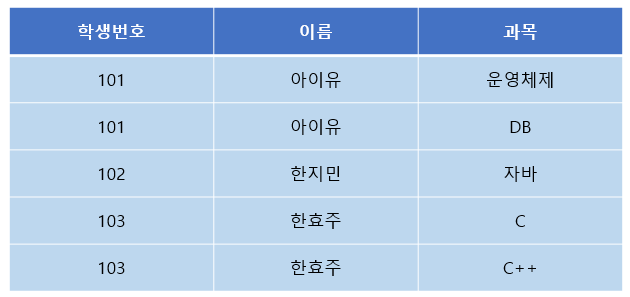
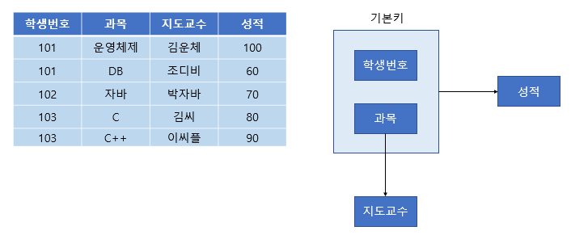
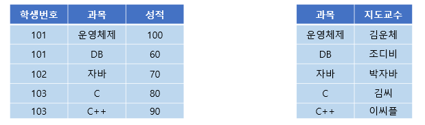
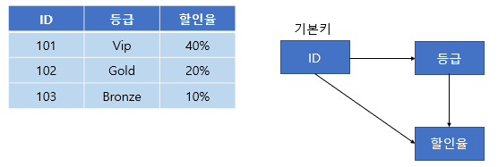
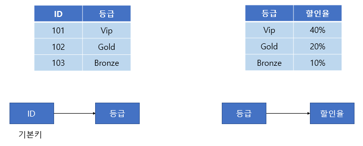

## 정규화
* ERD 내에서 중복요소를 찾아 제거해 나가는 과정
* 3차 정규화 정도면 설계에는 무리가 없음
* 정규화 과정은 릴레이션 간의 잘못된 종속관계로 인해 데이터 베이스 이상현상이 일어나 이를 해결하거나,
* 저장 공간을 효율적으로 사용하기 위해 릴레이션을 여러 개로 분리하는 과정
  * 기본 정규형 : 제 1, 2, 3 정규형, 보이스/코드 정규형
  * 고급 정규형 : 제 4, 5 정규형

### 정규화 원칙
* 같은 의미를 표현하는 릴레이션이지만 좀 더 좋은 구조로 만들어야 함
* 자료의 중복성은 감소
* 독립적인 관계는 별개의 릴레이션으로 표현
* 각각의 릴레이션은 독립적인 표현이 가능해야 함

### 제1정규화
* 릴레이션의 모든 도메인이 더 이상 분해될 수 없는 원자 값만으로 구성되어야 함
* 릴레이션의 속성 값 중에서 한 개의 기본키에 대해 두 개 이상의 값을 가지는 반복 집합이 있으면 안됨
* 반복 집합은 제거
  * 각 열이 원자적인 값을 갖도록 테이블을 재구성
  * 각 셀에는 하나의 값을 가지며, 다중 값은 제거
  * 중복을 줄이고 데이터를 원자적인 레벨로 분해

>제1정규화 필요

>제1정규형 만족

### 제2정규화
* **릴레이션이 제1정규형이면서 부분 함수의 종속성을 제거한 형태**
* **복합키의 일부분에 종속되는 속성들을 분리**
* 기본키가 아닌 모든 속성이 기본키에 완전 함수 종속적인 것
* 릴레이션을 분해할 때 동등한 릴레이션으로 분해
* 정보 손실이 발생하지 않는 무손실 분해로 분해
  * 부분 함수의 종속성 : 복합키 전체에 의존하지 않고 복합키의 일부분에만 종속하는 경우
  * 부분 함수 종속 제거
  * 기본 키의 모든 열이 기본 키에 종속
  * 테이블이 모든 기능 종속에 대해 완전해야함

>제2정규화 필요

>제2정규형 만족

### 제3정규화
* **제2정규형이고 기본키가 아닌 모든 속성이 이행적 함수 종속을 만족하지 않는 상태**
  * 이행적 함수 종속 : A -> B and B -> C 이면 논리적으로 A -> C 이다. 이때 C는 A에 이행적으로 함수 종속이 되었다라고 표현
* **기본키가 아닌 일반 칼럼에 의존하는 칼럼들을 분리**

>제3정규화 필요

>제3정규형 만족

참고 : https://www.youtube.com/watch?v=Y1FbowQRcmI&t=30s