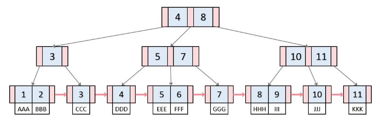

## 인덱스
* 인덱스는 데이터베이스에서 원하는 데이터를 빠르게 찾을 수 있게 해주는 장치
* 보통 B+트리 자료구조를 활용하여 인덱스 생성
* 인덱스는 균형잡힌 트리 구조와 트리 깊이의 대수확장성으로 인해 효율적
  * 대수확장성 : 트리 깊이가 리프 노드 수에 비해 매루 느리게 성장함
  * ex) 깊이3의 트리는 64개 레코드를 검색하지만,
  * 깊이10의 트리는 약100만개의 레코드 검색 가능

### B+트리

* 모든 key, data가 리프노드에 존재
* 데이터의 빠른 접근을 위해서 인덱스 역할만 하는 비단말 노드가 있음
* 모든 리프노드는 연결리스트로 구성
  * b tree에서는 다음 리프노드를 검사하려면 루트부터 다시 검사해야하지만,
  * b+tree에서는 현재 리프노드에서 다음 리프노드로 선형검사를 수행할 수 있어 시간복잡도가 줄어듬
* 데이터의 삽입/삭제 연산은 리프 노드에서만 발생

## 인덱스 생성 방법
### MySQL
* MySQL은 클러스터형 인덱스와 세컨더리 인덱스가 존재
* 클러스터형 인덱스는 테이블당 하나 설정 가능
  * 클러스터형 인덱스 : pk로 설정된 인덱스
* create index 명령어를 사용하면 세컨더리 인덱스 사용 가능
  * 세컨더리 인덱스 : 보조 인덱스로 여러 개의 필드 값으로 쿼리를 많이 보낼 때 생성

### MongoDB
* 도큐먼트를 생성하면 자동으로 ObjectID 형성하여 기본키 설정
* 세컨더리키와 기본키를 같이 쓰는 복합 인덱스 설정 가능

### 인덱스 최적화 기법
* 인덱스를 설정하고 사용하는 것에 비용이 든다는것 항상 생각
  * 생성, 수정, 삭제, 트리 조절, 데이터 분산 모두 비용이 든다
  * 따라서 모든 필드에 인덱스를 설정하는 것은 비효율적
* 컬렉션에서 가져와야하는 양이 많을수록 인덱스를 사용하는 것은 비효율적
* 인덱스 최적화는 서비스의 특징에 따라 다르다
  * 그러니 서비스에 맞게 사용하고, 항상 테스팅하기
  * EXPLAIN을 통해 테스팅하여 비교하기
* 복합 인덱스의 순서는 같 -> 정렬 -> 다중 값 -> 카디널리티 순서
  * 같음을 비교하는 쿼리를 제일 먼저 인덱스로 설정
  * 정렬에 쓰는 필드를 그다음 인덱스로 설정
  * 쿼리 자체에 > 나 < 등 많은 값을 출력해야하는 쿼리에 쓰는 필드는 인덱스 후순위
  * 카디널리티가 높은 순서를 기반으로 인덱스 생성
    * ex) 나이와 email 중에서는 email이 더 유니크하므로(카디널리티가 높다) 우선 순위

참고 : https://velog.io/@emplam27/%EC%9E%90%EB%A3%8C%EA%B5%AC%EC%A1%B0-%EA%B7%B8%EB%A6%BC%EC%9C%BC%EB%A1%9C-%EC%95%8C%EC%95%84%EB%B3%B4%EB%8A%94-B-Plus-Tree