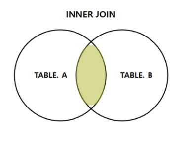
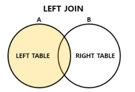
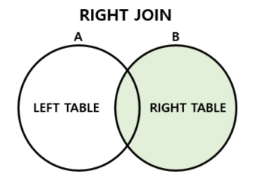
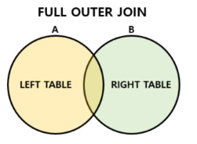

## JOIN 조인
* 조인은 두 개 이상의 테이블을 묶어서 하나의 결과물을 만드는 것
* MySQL에서 JOIN이라는 쿼리 사용
* MongoDB에서 lookup이라는 쿼리 사용
* inner join, left outer join, right outer join, full outer join 등이 있음

### inner join 내부 조인


* 두 테이블의 두 행이 모두 일치하는 행이 있는 부분만 표기
* 두 테이블간의 교집합

```SQL
SELECT * FROM TableA A
INNER JOIN TableB B ON
A.key = B.key;
```

### left outer join 왼쪽 조인


* 왼쪽 테이블의 모든 행을 표기
* 테이블 A를 기준으로 테이블 B의 일치하는 부분을 포함한 완전한 레코드 집합
* B에 일치하는 항목이 없으면 null 값

```SQL
SELECT * FROM TableA A
LEFT JOIN TableB B ON
A.key = B.key;
```
### right outer join 오른쪽 조인


* 오른쪽 테이블의 모든 행을 표기
* 테이블 B를 기준으로 테이블 A의 일치하는 부분을 포함한 완전한 레코드 집합
* A에 일치하는 항목이 없으면 null 값

```SQL
SELECT * FROM TableA A
RIGHT JOIN TableB B ON
A.key = B.key;
```

### full outer join 합집합 조인


* 두 테이블에서 조인 조건에 만족하지 않는 행까지 모두 표기
* 두 테이블의 합집합
* 테이블 A와 테이블 B의 모든 부분을 포함한 레코드 집합
* 일치하는 항목이 없으면 null 값

```SQL
SELECT * FROM TableA A
FULL OUTER JOIN TableB B ON
A.key = B.key;
```

### natural join 자연 조인
* 동일한 이름을 가진 컬럼을 기준으로 자동 결합

```SQL
SELECT * FROM TableA A
NATURAL JOIN TableB B;
```

### cross join 교차 조인
* 양쪽 테이블의 모든 행을 결합
* 두 테이블의 곱집합
* M행의 테이블과 N행의 테이블을 교차 조인하면 M*N행의 테이블 생성

```SQL
SELECT * FROM TableA A
CROSS JOIN TableB B;
```

## JOIN 알고리즘
* 중첩 루프 조인
* 정렬 병합 조인
* 해시 조인

### 중첩 루프 조인
* 쉽게 말해 중첩 for문의 형태로 join 조건 찾는 방법
* 대용량의 큰 테이블에서는 성능 저하가 일어나 사용x

### 정렬 병합 조인
* 두 테이블 모두 조인할 필드 기준으로 정렬시킨 후 조인 작업 수행
* 대용량의 큰 테이블이나 >, < 과 같은 범위 연산자 있을 때 사용
* 정렬 비용이 발생하므로 테이블의 크기와 인덱스에 따라 성능 변화

### 해시 조인
* 해시 테이블을 기반으로 조인
* 각 테이블의 조인 키를 해시화하여 해시 테이블을 생성하고, 두 해시 테이블을 조인
* 동등 조인에서 주로 사용
* 메모리 사용량이 크거나 조인 키의 분산이 불균형하면 성능 저하

## JOIN 사용시 주의 사항
* 조인 조건을 명확하게 하기
* 조인할 대상의 집합을 최소화하기
* 인덱스를 잘 활용하여 조인 연산의 비용 낮추기
