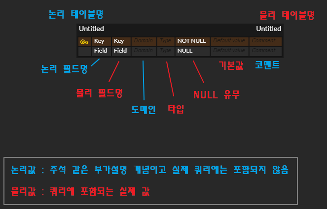
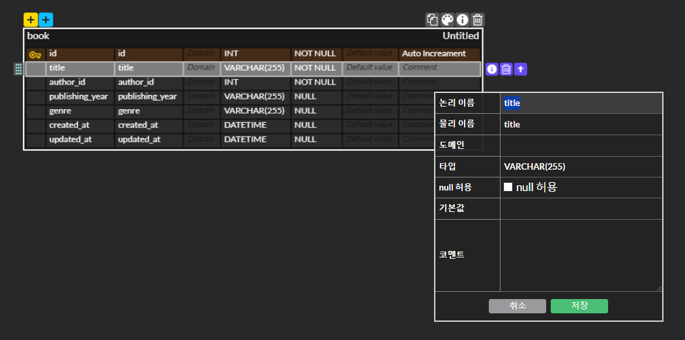
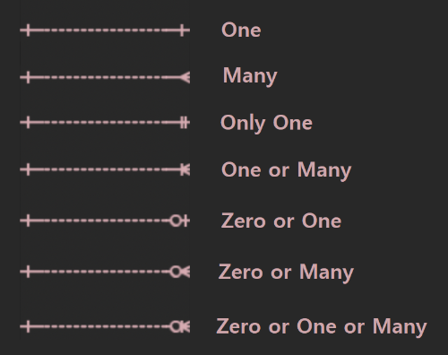
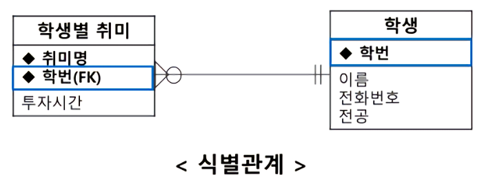
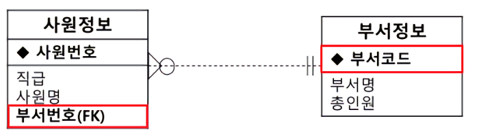
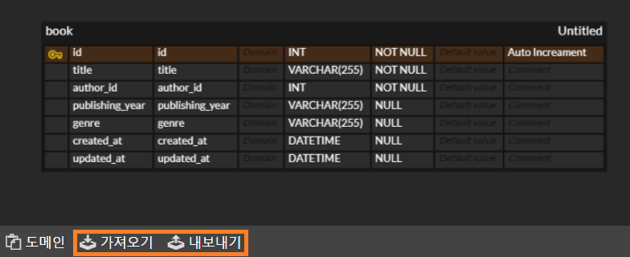
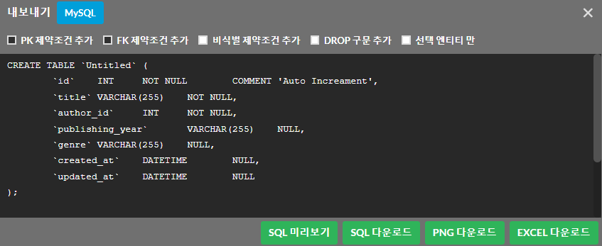

## erdcloud
https://www.erdcloud.com/

* erd 다이어그램 그릴 수 있는 툴
* 팀원들과 동시 작업 가능 (협업)
* sql 쿼리문 추출도 가능

### 테이블 생성

* 논리 테이블명
  * 테이블명에 대한 설명 (한글)
* 물리 테이블명 
  * 실제 테이블명 (영문)
* 논리 필드명 
  * 필드명에 대한 설명 (한글)
* 물리 필드명 
  * 실제 필드명 (영문)
* 도메인
  * 필드명에 대한 주제를 적는 곳 (주석 느낌)
* 타입 
  * 필드 타입 작성
* NULL 유무
  * NULL / NOT NULL 작성
* 기본값
  * default 값 작성
* 코멘트 
  * 주석

### 테이블 작성

* i 키 눌러서 편하게 작성 가능

### 테이블 관계

#### 식별 관계

* 부모 테이블(=참조되는 테이블)의 기본키를 자식 테이블(=참조하는 테이블)의 기본키로 이용하는 방법

#### 비식별 관계

* 부모 테이블(=참조되는 테이블)의 기본키를 자식 테이블(=참조하는 테이블)의 외래키로 이용하는 방법
* 점선으로 표기

### 쿼리 추출, 쿼리 가져오기

* 내보내기로 쿼리문 추출 가능
* 가져오기로 쿼리문 입력시 테이블 생성 가능

### 다른 프로젝트 구경해보기!
https://www.erdcloud.com/d/PK2Ae7d4asTRqHpHx

참고 https://inpa.tistory.com/entry/ERD-CLOUD-%E2%98%81%EF%B8%8F-ERD-%EB%8B%A4%EC%9D%B4%EC%96%B4%EA%B7%B8%EB%9E%A8%EC%9D%84-%EC%98%A8%EB%9D%BC%EC%9D%B8%EC%97%90%EC%84%9C-%EA%B7%B8%EB%A0%A4%EB%B3%B4%EC%9E%90 ㅇ