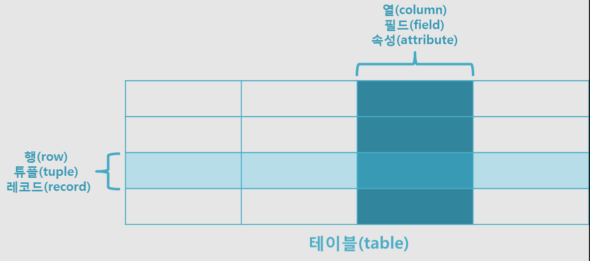

## 데이터베이스
* DB는 일정한 규칙을 통해 구조화되어 저장되는 데이터 모음
* DB를 제어 관리하는 시스템을 DBMS DataBase Management System
* DBMS마다 쿼리 언어를 통해 삽입, 조회, 수정, 삭제 rksmd

### Entity 엔티티
* 여러 개의 속성을 지닌 명사
* 사람, 장소, 사물, 사건 등과 같이 독립적으로 존재하면서 고유하게 식별 가능한 객체
* ex) 회원이라는 엔티티는 이름 아이디 전화번호 라는 속성을 가질 수 있다.
* A가 B의 존재 여부에 따라 종속적인 경우, A는 약한 엔티티 B는 강한 엔티티
  
### Relation 릴레이션
* 데이터베이스에서 정보를 구분하여 저장하는 기본 단위
* 관계형 데이터베이스에서는 '테이블'
* NoSQL 데이터베이스에서는 '컬렉션'

### Attribute 속성
* 릴레이션에서 관리하는 구체적이고 고유한 이름을 가지는 정보
* ex) 회원이라는 엔티티는 이름 아이디 전화번호 라는 속성을 가질 수 있다.

### Domain 도메인
* 릴레이션에 포함된 각각의 속성들이 가질 수 있는 값의 집합
* ex) 성별이라는 속성은 {남, 여}집합이 도메인이 된다.

### 필드와 레코드
