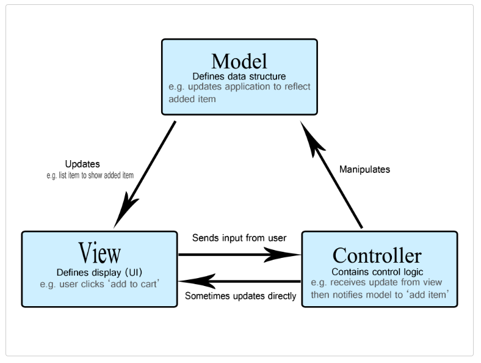
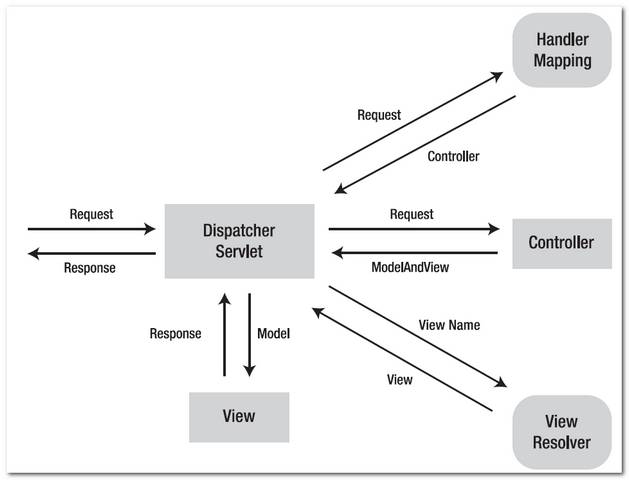

## MVC 패턴

* MVC 패턴은 Model, View, Controller로 이루어진 패턴
* 애플리케이션의 구성 요소를 M, V, C 세 가지 역할로 구분
* 재사용성과 확장성이 용이한 장점
* 애플리케이션이 복잡해질수록 모델과 뷰의 관계가 복잡해지는 단점

### Model
* Model은 애플리케이션의 데이터인 데이터베이스, 상수, 변수 등을 의미
* 데이터와 비즈니스 로직을 관리
* 데이터의 상태가 변경되면, View에 전달하여 화면 변경
* View에서 데이터를 생성하거나 수정하면, Controller를 통해서 Model을 생성하거나 갱신

### View
* 애플리케이션의 데이터를 보여주는 방식을 정의하며, 레이아웃과 화면을 처리
* inputbox, textarea 등 사용자 인터페이스 요소
* Model을 기반으로 사용자가 볼 수 있는 화면
* 사용자의 입력값을 Controller에 전달

### Controller
* 애플리케이션의 사용자 입력에 대한 응답
* Model 또는 View를 업데이트하는 로직 포함
* 이벤트 등 메인 로직을 담당
* Model과 View의 생명주기 관리
* Model이나 View의 변경 통지를 받으면 이를 처리하여, 각각의 구성 요소에 전달

## Spring MVC 프레임워크

* 클라이언트가 url을 요청하면, 웹 브라우저에서 스프링으로 request를 보냄
* Dispatcher Servlet이 request를 받으면, Handler Mapping을 통해 해당 url을 담당하는 Controller를 탐색
* 해당 Controller에게 request를 보내주고, 보내주기 위해 필요한 Model을 구성
* Model에서는 페이지 처리에 필요한 정보들을 Database에 접근하여 쿼리문을 통해 가져옴
* 데이터를 통해 얻은 Model 정보를 Controller에게 response 해주면, Controller는 이를 받아 Model을 완성시켜 Dispatcher Servlet에게 전달
* Dispatcher Servlet은 View Resolver를 통해 request에 해당하는 view 파일을 탐색
* 받아낸 View 페이지 파일에 Model을 보낸 후 클라이언트에게 보낼 페이지를 완성
* 완성된 View 파일을 클라이언트에 response하여 화면에 출력

### Dispatcher Servlet
* request를 처리하는 중심 컨트롤러
* 서블릿 컨테이너에서 http 프로토콜을 통해 들어오는 모든 request에 대해 제일 앞단에서 중앙집중식으로 처리해주는 핵심적인 역할

### Handler Mapping
* 클라이언트의 request url을 어떤 컨트롤러가 처리해야 할 지 찾아서 Dispatcher Servlet에게 전달하는 역할
* @RequestMapping 어노테이션

### Controller
* 실질적인 요청을 처리하는 곳
* 모델의 처리 결과를 담아 Dispatcher Servlet에 반환

### View Resolver
* 컨트롤러의 처리 결과를 만들 view를 결정해주는 역할

---
[MDN 참고](https://developer.mozilla.org/ko/docs/Glossary/MVC)