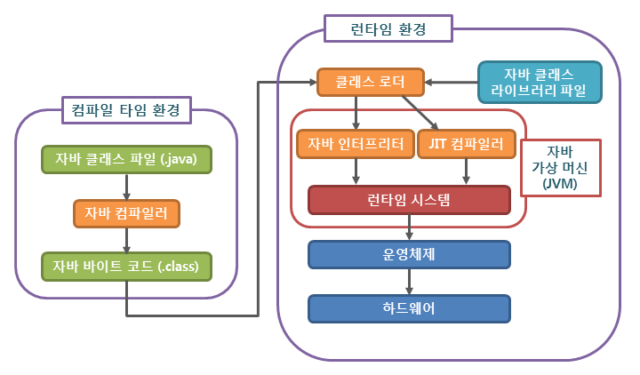
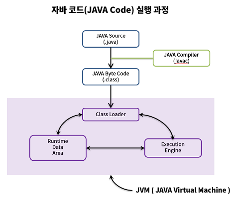
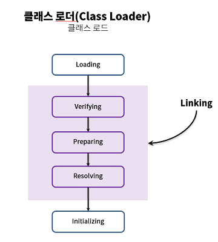
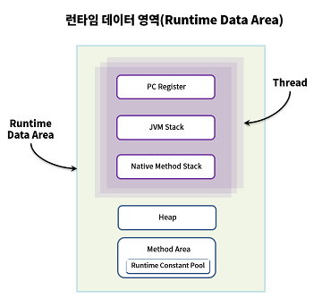

## Java 특징
* 어떤 종류의 CPU, OS 와 상관없이 컴파일된 코드(바이트 코드)가 플랫폼 독립적
* 어떤 플랫폼에서든 작성한 소스 코드의 변경없이 실행 가능
* 이를 위해서 JVM(Java Virtual Machine)이 필요
  * 바이트 코드를 실행시켜주는 가상머신
  * JVM은 H/W와 OS에서 실행되기에, JVM 자체는 플랫폼에 종속적

## Java 컴파일 과정

1. 자바 소스 코드(.java)를 작성
2. 자바 컴파일러(Java Compiler)가 자바 소스 코드(.java)를 자바 바이트 코드(Java Byte Code)로 컴파일
   * 자바 바이트 코드(.class)는 아직 컴퓨터가 읽을 수 없는 자바 가상 머신이 이해할 수 있는 코드
   * 바이트 코드의 각 명령어는 1바이트 크기의 Opcode와 추가 피연산자로 이루어져 있음
3. 컴파일된 바이트 코드를 JVM의 클래스로더(Class Loader)에게 전달
4. 클래스 로더는 동적로딩(Dynamic Loading)을 통해 필요한 클래스들을 로딩 및 링크하여 런타임 데이터 영역(Runtime Data area), 즉 JVM의 메모리에 올림
5. 실행엔진(Execution Engine)은 JVM 메모리에 올라온 바이트 코드들을 명령어 단위로 하나씩 가져와서 실행. 

### 클래스 로더 세부 동작

1. 로드 : 클래스 파일을 가져와서 JVM의 메모리에 로드
2. 검증 : 자바 언어 명세(Java Language Specification) 및 JVM 명세에 명시된 대로 구성되어 있는지 검사
3. 준비 : 클래스가 필요로 하는 메모리(필드, 메서드, 인터페이스 등)를 할당
4. 분석 : 클래스의 상수 풀 내 모든 심볼릭 레퍼런스를 다이렉트 레퍼런스로 변경
5. 초기화 : 클래스 변수들을 적절한 값으로 초기화 (static 필드)
   

### 실행 엔진 Execution Engine
* 실행 엔진은 클래스 로더를 통해 런타임 데이터 영역에 배치된 바이트 코드를 명령어 단위로 읽고 실행
* 두 가지 방식 존재
* Interpreter
  * 바이트 코드 명령어를 하나씩 읽어서 해석하고 실행
  * 하나하나의 실행은 빠르나, 전체적인 실행 속도가 느림
* JIT Compiler (Just-In-Time Compiler)
  * Interpreter의 단점을 보완
  * 바이트 코드 전체를 컴파일하여 바이너리 코드로 변경하고 이후에는 해당 메서드를 더이상 인터프리팅 하지 않고, 바이너리 코드로 직접 실행하는 방식
  * 하나씩 인터프리팅하여 실행하는 것이 아니라 바이트 코드 전체가 컴파일된 바이너리 코드를 실행하는 것이기 때문에 전체적인 실행속도는 인터프리팅 방식보다 빠름
  * 한 번 컴파일된 코드를 캐시에 보관했다가 꺼내어 실행하기 때문에 빠르게 수행
  * 하지만 JIT 컴파일러가 컴파일 하는 과정이 오래 걸리기 때문에, JVM은 내부적으로 해당 메서드가 얼마나 자주 호출되고 실행되는지 체크하고, 일정 기준을 넘었을 때에 JIT 컴파일러를 통해 컴파일

### 런타임 데이터 영역 Runtime Data Area

* JVM이 OS위에서 실행 되면서 할당받는 영역
* PC Register, JVM stack Native Method Stack은 스레드마다 하나씩 생성
* Heap, Method Area는 모든 스레드가 공유해서 사용
* PC Register
  * Program Counter Register는 현재 수행 중인 명령의 주소를 가지며 스레드가 시작될 때 생성
* JVM stack
  * Stack Frame이라는 구조체를 저장하는 스택
  * 예외 발생 시 printStackTrace() 메서드를 보여주는 Stack Trace의 각 라인 하나가 스택 프레임을 표현
* Native Method Stack
  * Java 외의 언어로 작성된 네이티브 코드를 위한 스택
  * 언어에 맞게 스택이 생성
* Heap
  * 인스턴스 또는 객체를 저장하는 공간
  * Garbage Collection 대상
* Method Area
  * JVM이 읽어 들인 각각의 클래스와 인터페이스에 대해 런타임 상수 풀, 필드와 메서드에 대한 정보, Static 변수, 메서드의 바이트 코드 등을 보관

참고

[1] https://steady-snail.tistory.com/67
[2] https://d2.naver.com/helloworld/1230