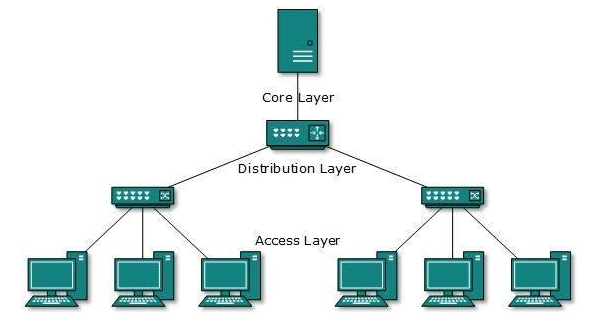
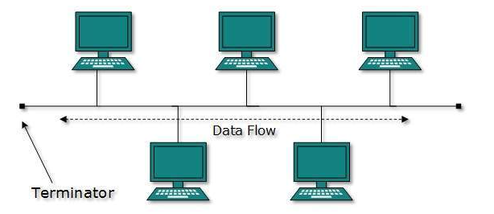
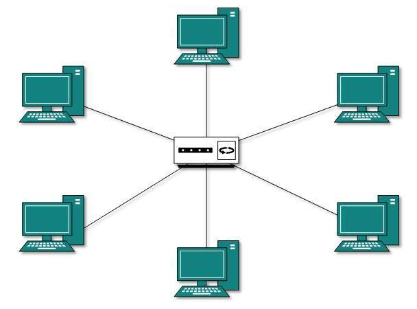
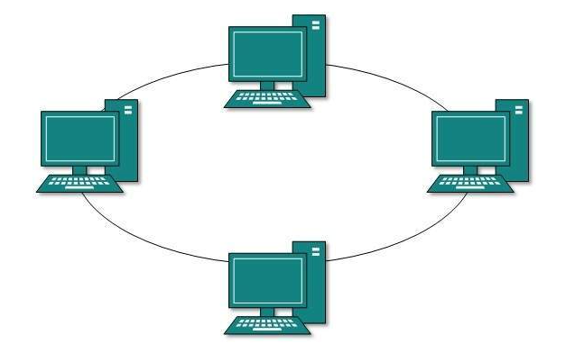
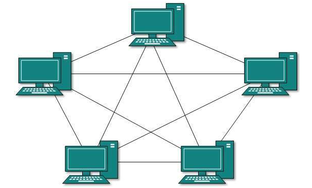

## 네트워크 기초
* 노드와 링크로 연결되어 리소스를 공유하는 집합
* 노드는 서버, 라우터, 스위치 등 네트워크 장치에 해당
* 링크는 유선, 무선 연결에 해당
* 좋은 네트워크란 많은 처리량을 다루면서, 지연 시간이 짧고, 장애 빈도가 적고, 보안이 좋은 네트워크

### 처리량 throughput
* 링크를 통해 전달되는 단위 시간당 데이터양
* bps (bits per second) 를 단위로 사용
* 처리량은 많은 사용자들이 접속할 때 증가하는 트래픽의 양, 네트워크 장치 간의 대역폭, 네트워크 중간에 발생하는 에러, 장치의 하드웨어 스펙에 영향을 받음
  * 대역폭 : 주어진 시간 동안 네트워크 연결을 통해 흐를 수 있는 최대 비트 수

### 지연시간 latency
* 요청이 처리되는 시간
* 두 장치 사이를 와복하는데 걸린 시간
* 지연 시간은 매체 타입(유무선), 패킷 크기, 라우터의 패킷 처리 시간에 영항을 받음

## 네트워크 토폴로지 network topology
* 노드와 링크가 어떻게 배치되어 있는지에 대한 방식
* 네트워크 연결 형태

### 트리 토폴로지 tree topology

* 트리 계층형 토폴로지
* 트리 형태로 배치한 네트워크 구성
* 노드의 추가 삭제가 쉽고, 특정 노드에 트래픽이 집중될 때 하위 노드에 영향을 줄 수 있음

### 버스 토폴로지 bus topology

* 중앙 통신 회선(bus) 하나에 여러 개의 노드가 연결되어 공유하는 네트워크 구성
* 근거리 통신망 LAN 에 사용
* 노드의 추가 삭제가 쉽고, 설치 비용이 적으며 신뢰성이 우수
* 스푸핑이 가능한 문제점

#### 스푸핑
* LAN 상에서 송신부의 패킷을 관련이 없는 악의적인 노드에 해당 패킷이 오도록 처리
* 송신과 관련없는 다른 호스트에 가지 않도록 하는 스위치 기능을 마비시키거나 속여 스푸핑

### 스타 토폴로지 star topology

* 중앙에 있는 노드에 모두 연결된 네트워크 구성
* 노드를 추가하거나 에러를 탐지하기 쉽고, 패킷의 충돌 발생 가능성이 적음
* 특정 노드에 장애가 발생할 때 파악이 쉽고, 해당 장에가 다른 노드에 끼치는 영향이 적음
* 하지만 중앙 노드에 장애가 발생하면 전체 네트워크가 마비됨
* 설치비용이 비쌈

### 링형 토폴로지 ring togology

* 각각의 노드가 양 옆의 두 노드와 연결하여 고리(ring)처럼 하나로 연결된 네트워크 구성
* 각각의 노드는 고리 모양의 길을 통해 패킷 처리하기에
* 노드 수가 증가되어도 네트워크상의 손실이 없고
* 충돌이 발생되는 가능성이 적으며, 장애를 쉽게 파악할 수 있음
* 하지만 네트워크 구성 변경이 어렵고, 회선에 장애가 발생하면 전체 네트워크에 영향을 끼침

### 메쉬 토폴로지 mesh topology

* 망형 토폴로지, 그물망처럼 연결되어 있는 네트워크 구조
* 하나의 노드에 장애가 발생해도, 여러 개의 경로가 존재하여 네트워크 사용 가능
* 트래픽 분산처리 가능
* 노드의 추가가 어렵고 구축 비용과 운용 비용이 비쌈

### 병목현상 bottleneck
* 전체 시스템의 성능이나 용량이 하나의 구성 요소로 인해 제한 받는 현상
* 서비스에서 트래픽이 많이 발생했을 때, 해당 트래픽을 관리하지 못하면 병목현상이 생겨 다른 사용자가 해당 서비스를 이용할 수 없게 됨
* 네트워크가 어떤 토폴로지로 구성되어 있는지, 어떤 경로로 이루어져 있는지 파악해야 병목현상 개선 가능
* 주 원인
  * 네트워크 대역폭
  * 네트워크 토폴로지
  * 서버 CPU, 메모리 사용량
  * 비효율적인 네트워크 구성

## 네트워크 분류
* LAN (Local Area Network)
  * 근거리 통신망
  * 같은 건물이나 좁은 공간에서 운영
  * 전송 속도가 빠르고 혼잡하지 않음
* MAN (Mettropolitan Area Network)
  * 대도시 지역 네트워크
  * 도시 같은 넓은 지역에서 운영
  * 전송 속도가 평균, LAN보다 많이 혼잡
* WAN (Wide Area Network)
  * 광역 네트워크
  * 국가 또는 대륙 같은 넓은 지역에서 운영
  * 전송 속도가 낮고 MAN보다 많이 혼잡

## 네트워크 성능 분석
* 코드상에서 문제가 없는데 실제 서비스에서 데이터를 가져오지 못하는 경우, 병목현상일 수 있음
* 네트워크 문제일 경우 성능 분석 필요

### PING
```
ping [IP 주소 or 도메인 주소]
```
* Packet INternet Groper
* 네트워크 상태를 확인하려는 특정 노드를 향해 일정 크기의 패킷을 전송하는 명령어
* 해당 노드의 패킷 수신 상태와 도달하기까지의 시간 파악 가능
* TCP/IP 프로토콜 중 ICMP 프로토콜을 통해 동작
  * ICMP프로토콜을 지원하는 기기에서 테스트 가능

### netstat
```
netstat
```  
* 접속되어 있는 서비스들의 네트워크 상태를 표시하는 명령어
* 네트워크 접속, 라우팅 테이블, 네트워크 프로토콜 등을 부여줌
* 서비스의 포트가 열려있는지 확인할 때 주로 사용

### nslookup
```
nslookup
```
* DNS에 관련된 내용을 확인할 때 사용하는 명령어
* 특정 도메인에 매핑된 IP 확인할 때 사용

### tracert (윈도우) / traceroute(리눅스)
```
tracert [IP 주소 or 도메인 주소]
```
* 목적지 노드까지 네트워크 경로를 확인할 때 사용하는 명령어
* 어느 구간에서 응답 시간이 느려지는지 확인 가능