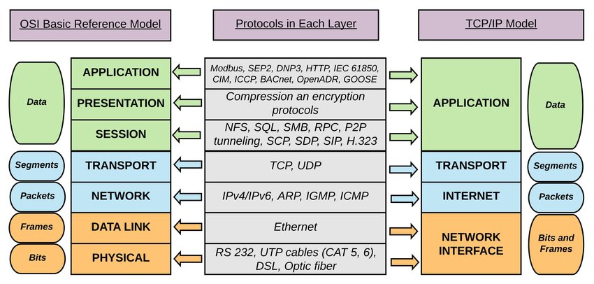
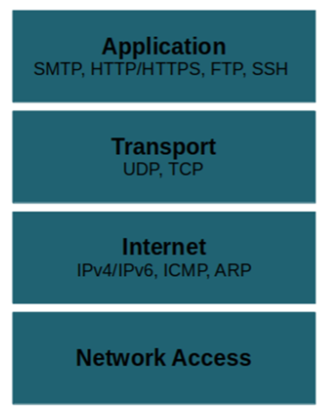

## 네트워크 모델

* internet protocol suite는 인터넷에서 컴퓨터들이 정보를 주고받는 데 사용하는 프로토콜의 집합
* 이를 TCP/IP 4계층 모델 또는 OSI 7계층 모델로 설명
* 애플리케이션 계층과 네트워크 인터페이스 계층을 나눠서 표현

## TCP/IP 4계층 모델

### 애플리케이션 계층
* 응용 프로그램이 사용되는 프로토콜 계층
* 웹 서비스를 실질적으로 사용자들에게 제공하는 계층
* FTP, HTTP, SSH, SMTP, DNS
  * FTP : 장치와 장치 간의 파일을 전송하는데 사용하는 표준 통신 프로토콜
  * SSH : 보안되지 않은 네트워크에서 네트워크 서비스를 안전하게 운영하기 위한 암호화 네트워크 프로토콜
  * HTTP : WWW을 위한 데이터 통신의 기초, 웹 사이트를 이용하는데 사용하는 프로토콜
  * SMTP : 전자 메일 전송을 위한 인터넷 표준 통신 프로토콜
  * DNS : 도메인 이름과 IP 주소를 매핑해주는 서버

### 전송 계층
* 송신자와 수신자를 연결하는 통신 서비스를 제공
* 연결 지향 데이터 스트림 지원, 신뢰성, 흐름 제어 제공
* 애플리케이션 계층과 인터넷 계층 사이에서 데이터 중계 역할
* TCP, UDP
  * TCP
    * 패킷 사이의 순서를 보장
    * 연결지향 프로토콜을 사용해 수신여부를 확인
    * 가상회선 패킷 교환 방식 사용
  * UDP
    * 패킷 사이의 순서를 보장하지 않음
    * 수신 여부를 확인하지 않음
    * 데이터그램 패킷 교환 방식 사용

#### 가상회선 패킷 교환 방식
#### 데이터그램 패킷 교환 방식

### [TCP 연결 과정](./230623%20TCP%20연결과정.md)
#### TCP 연결 과정 3-way handshaking
#### TCP 연결 해제 과정 4-way handshaking

### 인터넷 계층
* 장치로부터 받은 네트워크 패킷을 IP주소로 전송하기 위해 사용되는 계층
* 패킷을 수신해야 할 상대의 주소를 지정하여 데이터 전달
* 상대방이 제대로 수신하였는지 보장하지 않는 비연결형적인 특징
* IP, ARP, ICMP

### 링크 계층, 네트워크 접근 계층
* 전선, 광섬유, 무선 등 실질적으로 데이터를 전달하고 장치 간의 신호를 주고받는 규칙을 정하는 계층
* Link 계층 또는 Network Interface 계층으로 부름
* 물리 계층과 데이터 링크 계층으로 나눌 수 있음
  * 물리 계층 : 유무선 LAN을 통해 데이터를 보내는 계층
  * 데이터 링크 계층 : 이더넷 프레임을 통해 에러 확인, 흐름 제어, 접근 제어를 담당하는 계층

## 계층 간 데이터 송수신 과정
