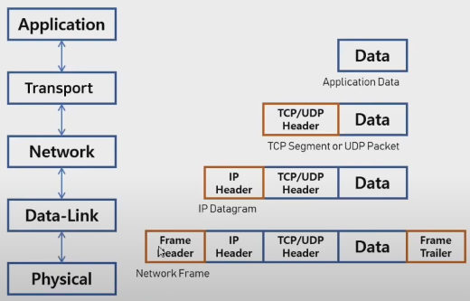
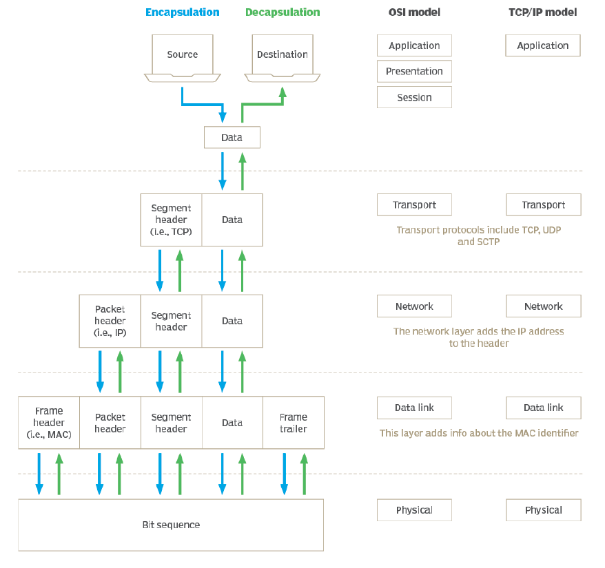

## OSI 7 Layers
* 네트워크 통신을 단계별로 계층으로 나눈 모델
* 각 계층은 독립적인 역할로 동작
* 문제 해결시 원인 파악 용이
* 각 계층에서의 작업을 시각적으로 표현 용이

* 
* 

### L1 : Physical
* 물리적인 전송 기술
* 케이블, 허브, 리피터
* Bit 단위

### L2 : Data Link
* 물리적인 네트워크를 통해 데이터 전송
* 물리적인 장치를 식별하기 위한 MAC 주소 제공
* 투 포인트 간의 신뢰성 있는 전송 보장
* Bridge, Switch 등의 장비
* Frame 단위

### L3 : Network
* 라우터를 통해 IP주소를 제공하는 역할
* IP, ICMP, ARP
* Packet 단위

### L4 : Transport
* 하위 계층으로 신뢰할 수 있는 데이터 전송
* 송수진자 간의 논리적 연결 수행
* 단말(Endpoint)간 전달 데이터의 오류 제어
* TCP, UDP
* Segment 단위(TCP), 데이터크램 단위(UDP)

### L5 : Session
* 응용 시스템간의 세션 관리
* 통신 장치 간의 연결 설정 및 관리
* 송수신자 간의 통신을 위해 동기화 신호 주고 받음
* 통신 방식 ex) 단순(TV), 반이중(무전기), 전이중(전화)
* SSH, SSL (TLS) 등의 프로토콜

### L6 : Presentation
* 응용 계층으로부터 받은 데이터를 읽을 수 있는 형식으로 변환
* 데이터의 인코딩, 디코딩, 암호화, 복호화 등의 기능
* 확장자 개념 사용
* JPEG, MPEG, ASCII 

### L7 : Application
* 서비스단
* HTTP, FTP, DHCP, POP3 등의 프로토콜

* 