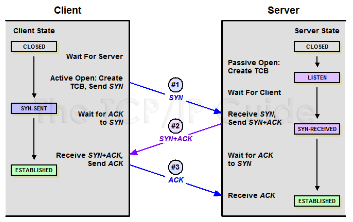
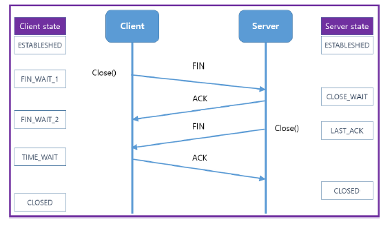
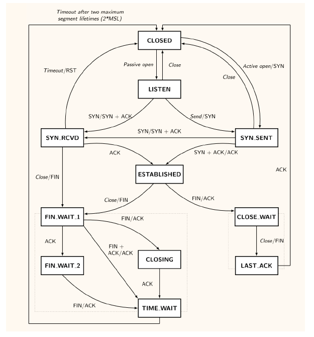

## TCP 연결
* TCP에는 연결과 상태 개념이 존재
* L4 단계, PDU : Segment
* Sequence number + 정책 교환
  * 정책에는 MSS (Maximum Segment Size)
* SYN : synchronization (연결 요청)
* ACK : acknowledgment (승인 응답)
* FIN : finish (종료 요청)

## TCP 연결 과정 3-way handshaking

* 연결 설정을 위한 segment 단위를 주고 받음 
* Client에서 Sequence number 생성 ex) 7000
* Server에서 Sequence number 생성 ex) 3000
* (1) Server에서 연결 대기 상태에서 SYN 수신
  * SYN 7000
* (2) Server에서 Client로 SYN를 수신했다는 응답 SYN + ACK
  * SYN 3000 + ACK 7001
  * ACK 는 SYN + 1 한 값
* (3) Client에서 Server로 ACK를 수신했따는 응답 ACK
  * ACK 3001
* 1, 2, 3 단계에 맡게 각각의 **상태 변환**
* ACK를 받은 시점에 연결이 되었다고 판단
* Client와 Server가 ACK를 받는 시점에 차이가 발생
  * (2) 와 (3) 사이의 시간

## TCP 연결 종료 과정 4-way handshaking

* (1) Client에서 Server로 연결 종료 요청 FIN + ACK
* (2) Server에서 Client로 수신 확인 응답 ACK
* (3) Server에서 Client로 연결 종료 오청 FIN + ACK
* (4) Client에서 Server로 수신 확인 응답 ACK
* 두 번의 연결 종료 요청 사이의 시간차 발생
  * TIME_WAIT 상태로 전환 후, 일정 시간이 지나면 CLOSED
  * Client에서 연결 종료를 요청하기에, Client에서만 TIME_WAIT 발생
  * 그래서 상식적으로 Client는 Active open, Server는 Passive open

## TCP 상태 변화 전체 흐름
