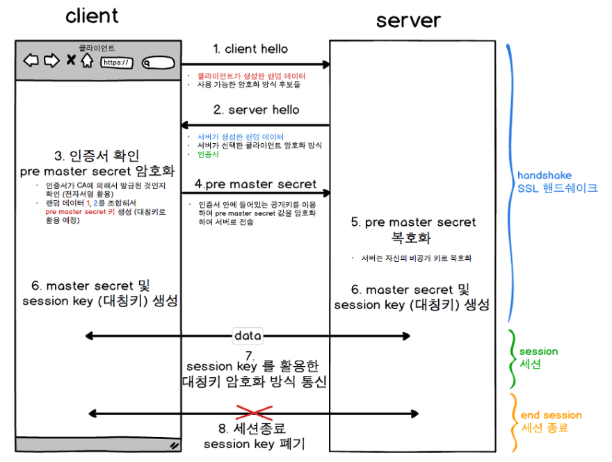

## 대칭키
* 암호화와 복호화에 같은 암호키를 사용하는 알고리즘
* 동일한 키를 주고 받아 속도가 빠르다
* 데이터를 주고 받는 양쪽이, 동일한 대칭 키를 공유하기 위해 한번은 키를 전송해야함
* 이런 대칭키 전달 과정에서 해킹 위험에 노출

## 공개키 (비대칭키)
* 암호화와 복호화에 사용하는 암호키를 분리하여 사용하는 알고리즘
* 두 키들 중 하나는 비밀로 보관 (개인키)
* 다른 하나는 대중에 공개 (공개키)
* 서버에서 개인키로 암호화하여 데이터 전송, 사용자는 공개키로 복호화하여 사용
* 사용자가 공개키로 암호화하여 데이터 전송, 서버에서 개인키로 복호화, 다른 사용자가 공개키로 복호화 불가
* 해당 서버의 공개키가 맞는지 CA를 통한 검증 필요
  * CA : Certificate Authority 공개키를 인증해주는 공인된 민간기업

### 개인키와 공개키
* 공개키 알고리즘은 공개키로 암호화 하냐, 개인키로 암호화 하냐에 따라 사용분야, 성격이 달라짐
* 공개키로 암호화 하면 **<u>데이터 보안에 중점</u>**
  * 개인키 소유자만 복호화 가능 -> 암호로서 효용성 : 암호화
* 개인키로 암호화 하면 **<u>인증 과정에 중점</u>**
  * 공개키로 누구나 복호화 가능 -> 암호문 작성자를 알리는 용도 : 전자서명

## HTTP
* Hyper Text Transfer Protocol
* 인터넷에서 클라이언트와 서버가 자원을 주고 받을 때 쓰는 통신 규약

## HTTPS
* Hyper Text Transfer Protocol Secure
* SSL 프로토클을 통해 정보를 암호화하여 자원을 주고 받을 때 쓰는 통신 규약

## HTTPS 통신 흐름

1. 클라이언트에서 랜덤 데이터를 생성해서 서버에 전송
2. 서버에서 랜덤 데이터 생성 + 해당 서버의 인증서를 클라이언트에 전송
    * 랜덤 데이터를 주고 받는 과정을 handshake라고 함
3. 클라이언트는 브라우저에 내장된 CA들의 정보를 통해 서버의 인증서 검증
4. 서버의 인증서는 CA의 개인키로 암호화되어 있어, 브라우저에 저장된 CA의 공개키로 복호화 가능
5. CA들 중 인증서에 해당하는 것이 없다면, 안전하지 않음(Not Secure) 표시
    * SSL 인증 미적용의 경우에도 Not Secure 표시
6. 복호화된 인증서에는 서버의 공개키가 존재
7. 클라이언트에서 handshake 과정에서 통신한 랜덤 데이터를 조합하여 대칭키를 생성
8. 서버의 공개키를 이용하여 대칭키를 공유
9. 이 대칭키로 데이터 암호화하여 통신

[참고](https://www.youtube.com/watch?v=H6lpFRpyl14)