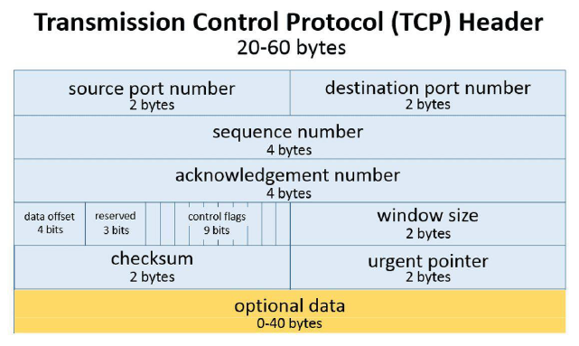

## TCP

* Transmission Control Protocol
* 연결 과정이 존재 
  * 3-way handshake : 연결 
  * 4-way handshake : 연결 종료
* 패킷 손실, 중복을 방지하고 순차 전송 보장
  * 시퀀스 넘버를 통해 데이터의 순서 식별
* 흐름 제어, 혼잡 제어, 오류 감지를 통해 **<u>신뢰성 보장</u>**
* 매번 연결을 하기에 시간 손실 발생
* 패킷을 조금만 손실해도 재전송
* 20 ~ 60 바이트
* HTTP2.0 이하의 버전 대부분에 사용

### 흐름제어
* 수신측의 데이터 처리 속도보다, 송신측의 데이터 전송 속도가 빠르면 문제가 발생
* 이를 위해 **데이터를 보내는 속도를 조절**하는 기능
* 수신자의 버퍼 오버플로우 방지
* 윈도우의 크기를 설정하여 속도 조절
  * stop and wait : 매번 전송 완료를 확인 후, 다음 전송
  * 
  * sliding window : 데이터의 흐름을 동적으로 조절

### 혼잡제어
* 네트워크 내에 패킷 수가 과도하게 증가하는 것을 혼잡이라고 함
* 이런 혼잡 현상을 방지, 제거하는 기능을 혼잡 제어
* 네트워크가 혼잡해지지 않도록 **패킷 수를 조절**
* 수신자로부터 받은 ACK 패킷을 통해 송신자가 조절
  * 
  * AIMD
  * slow start
  * fast retransmit
  * fast recovery

## UDP

* User Datagram Protocal
* 비연결형 전송 프로토콜
* 연결 과정이 없고 **신뢰성이 낮음**
* 혼잡제어x, 흐름제어x, 오류 검사후 재전송x, 필요한 것들은 어플리케이션단에서 처리
* 연결을 유지하고 해제하는데 드는 비용이 없는 대신 **<u>속도가 빠르다</u>**
* 8바이트 고정
* 비교적 데이터의 신뢰성이 중요하지 않고, 속도가 중요한 경우에 사용
  * DNS 서버, 게임 서버, 영상 스트리밍, HTTP3.0
  * 실시간 스트리밍과 같은 속도가 중요한 경우에 사용