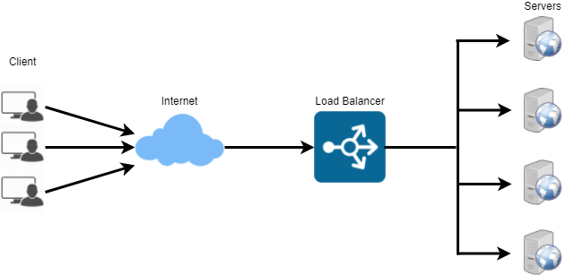
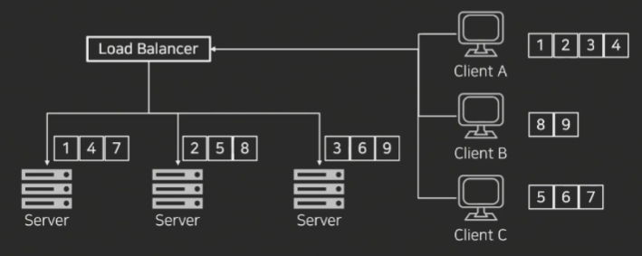
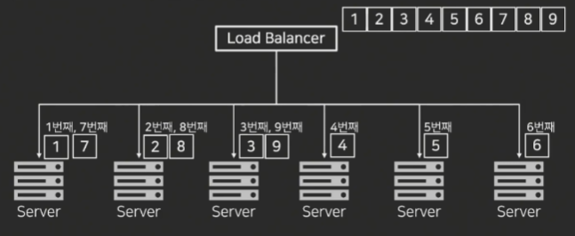
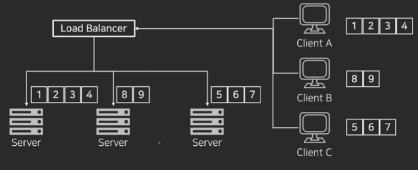

## 로드 밸런서 Load Balancer

* 서버의 로드율 증가, 부하량, 속도저하 등을 고려하여 서버의 부하를 분산해주는 기술 및 장치
* 보통 서버 상단 네트워크에 위치
* 서버 한대에 집중되지 않도록 트래픽을 분산시켜 관리

### 로드 밸런서 기본 기능
* Health Check
  * 서버의 상태 체크
* 알고리즘에 따른 분산 처리 
  * ex) Round Robin 방식
* NAT Network Address Translation
  * 1개의 공인 IP에 여러 개의 비공인 IP 매핑
* DSR Direct Server Return
  * 서버에서 로드 밸런서를 거치지 않고 바로 클라이언트로 전송

### 로드 밸런서 종류
* L2 : MAC
* L3 : IP
* L4 : 포트 
* L7 : 사용자의 Request 

### 로드 밸런싱 알고리즘
#### Least Connection 알고리즘
* 현재 매핑되어 있는 커넥션이 가장 작은 서버로 세션을 연결

#### Round Robin 알고리즘
* 들어오는 트래픽을 서버 순서대로 배치
* 연결된 세션이 비교적 오래 사용되지 않는 경우에 채택하면 좋음

#### Hash 알고리즘
* 특정 기준으로 특정 서버에 매핑하여 고정적으로 트래픽을 분산
* 일반적으로 클라이언트의 IP를 기준으로 사용

[참고1](https://www.youtube.com/watch?v=kYipnodgi2I)

[참고2](https://nesoy.github.io/articles/2018-06/Load-Balancer)