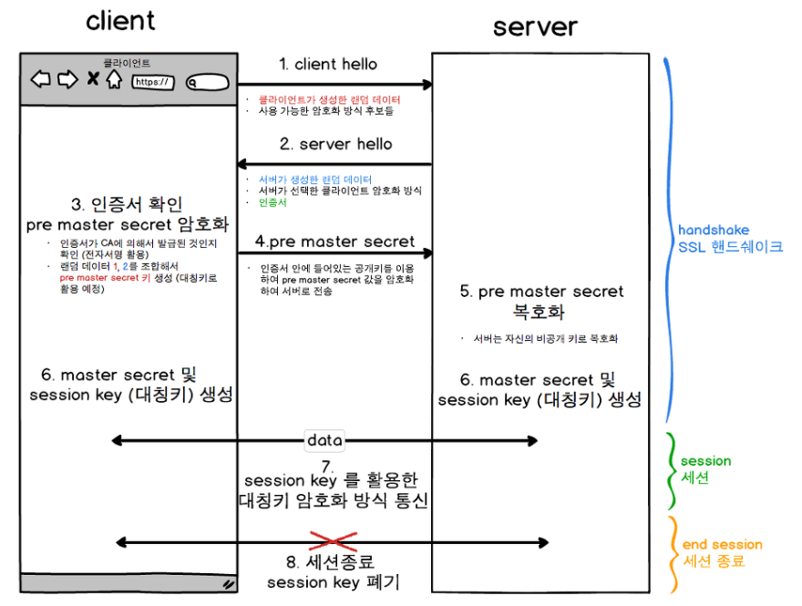

## SSL TLS
* Secure Socket Layer
* Transport Layer Security
  * TLS1.0은 SSL3.0을 계승한 것
  * SSL이라는 이름이 더 일반적으로 사용

### SSL 인증서
* SSL 인증서, 디지털 인증서라고도 불림
* 클라이언트와 서버간의 통신을 제 3자가 보증해주는 전자화된 디지털 문서
* 통신 내용이 공격자에게 노출되는 것을 막을 수 있음
* 클라이언트가 접속하려는 서버가 신뢰할 수 있는 서버인지 판단
* 통신 내용의 변경 방지

### SSL 인증서의 내용
1. 서비스의 정보 
   * 인증서를 발급한 CA
   * 서비스의 도메인
2. 서버 측 공개키 
   * 공개키의 내용
   * 공개키 암호화 방법

### SSL 인증서가 서비스를 보증하는 방법
1. 서버에서 SSL 인증서를 제공
2. 브라우저는 이 인증서를 발급한 CA가 자신이 내장한 CA의 리스트에 있는지 확인
3. 내장된 CA 리스트에 포함되어 있다면, 해당 CA의 공개키를 이용해서 인증서를 복호화
   * CA의 공개키를 이용해서 인증서를 복호화 할 수 있다면
   * 인증서가 CA의 개인키에 의해서 암호화 된 것을 의미
   * 즉 서버가 제공한 인증서가 CA에 의해 발급된 것임을 의미
   * 개인키로 암호화된 정보를 공개키로 복호화하여 암호화한 주체를 확인하는 과정을 <u>**전자서명**</u>이라고 함
4. 해당 서비스가 CA의 검토를 통과한 신뢰 할 수 있다는 것을 의미

### SSL 동작 방법

* 악수 -> 전송 (세션) -> 세션 종료
* 대칭키와 공개키 방식을 혼합하여 사용
  * 공개키 방식을 사용하여 데이터를 주고받게 되면
  * 많은 컴퓨팅 파워가 사용되기 때문에
  * 대칭키 전달에 공개키 방식을 사용한 후
  * 대칭키 방식으로 통신

### Handshake
#### (1) client hello
* 클라이언트에서 생성한 랜덤 데이터
* 클라이언트가 지원하는 암호화 방식
* 세션 아이디
* 를 서버에 전송

#### (2) server hello
* 서버에서 생성한 랜덤 데이터
* 서버의 암호화 방식
* SSL 인증서
* 를 클라이언트에 응답

#### (3) 인증서 확인
* 인증서를 발급한 CA를 브라우저의 CA 리스트에 있는지 확인
* 해당 CA 공개키로 인증서 복호화
  * 복호화 성공시 인증서 검증
  * CA리스트에 없거나, 복호화 실패 시, SSL 방식이 아닌경우 보안 경고 출력

#### (4) ~ (6) 대칭키 전달
* 클라이언트에서는 클라이언트가 생성한 랜덤 데이터와 서버가 생성한 랜덤 데이터를 조합하여 pre master secret 값을 생성 후, 서버에 전달
* 생성한 pre master secret 값을 서버의 공개키로 암호화하여 서버에 전달
  * 공개키 방식으로 대칭키를 전달
* 서버에서는 서버의 개인키로 복호화하여 master secret 값 생성
* 서버와 클라이언트 모두 pre master secret를 공유하게 됨
* pre-master secret과 client random, server random을 이용해 session key(대칭키)를 유도
* 이후로 session key(대칭키)로 암호화하여 데이터 통신

#### handshake 단계 종료 확인

### 세션
#### (7)
* 실제로 서버와 클라이언트가 데이터를 주고 받는 단계
* session key(대칭키)를 이용해 암호화하여 통신

### 세션 종료
#### (8)
* SSL 통신 종료 확인
* 통신에 사용한 session key(대칭키) 폐기

[참고1](https://opentutorials.org/course/228/4894)

[참고2](https://dokydoky.tistory.com/463)