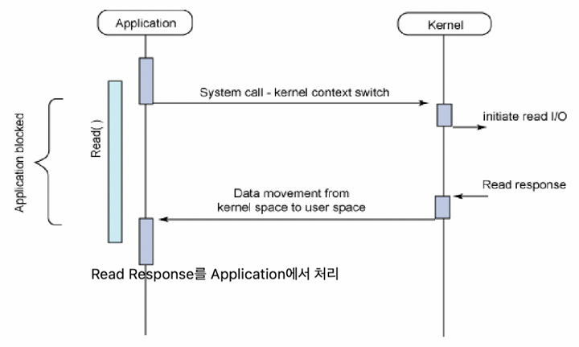
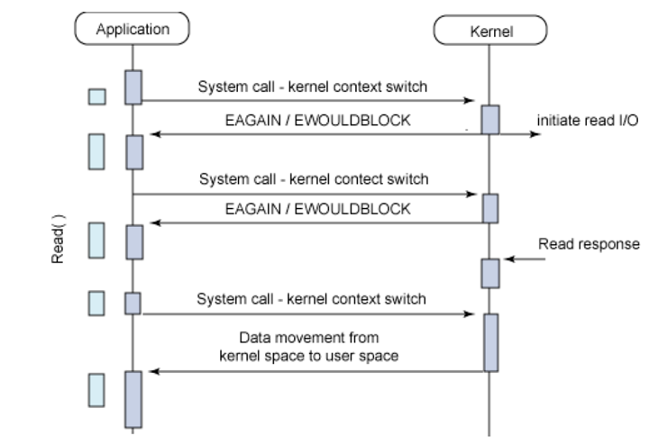

## Blocking vs Non-blocking
* 자신의 작업을 진행하다가, 다른 주체의 작업이 시작되면...
* Blocking : 다른 작업이 끝날 때까지 기다렸다가 자신의 작업 시작
* Non-Blocking : 다른 주체의 작업에 관련없이 자신의 작업을 진행
* 제어권의 관점

## Synchronous vs Asynchronous
* Synchronous : 작업의 시작 또는 종료가 일치하거나, 끝나는 동시에 시작함
* Asynchronous : 작업의 시작 종료가 일치하지 않고, 끝나는 동시에 시작하지 않음
* 순서와 결과의 관점

## Blocking + Synchronous

* 함수를 호출한 뒤, 호출된 함수의 결과값이 반환되면 다음 작업 이어서 진행
* 일반적인 동기 함수의 동작 방식
* 일반적인 Java 프로그래밍

## Non-blocking + Asynchronous

* 함수를 호출한 뒤, 호출된 함수의 결과와 관계없이 작업 진행 
* 일반적인 비동기 함수 동작 방식
* 일반적인 JavaScript 프로그래밍

## Non-blocking + Synchronous

## Blocking + Asynchronous

