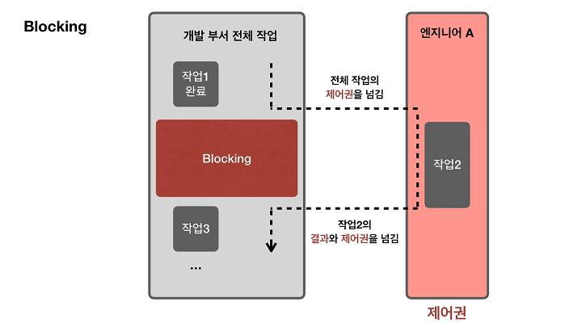

## Blocking vs Non-blocking
* **제어권의 관점**
* I/O, 네트워크 통신, 웹 요청

### Blocking

* 호출자는 호출된 함수가 완료될 때까지 **다른 작업을 수행하지 못하고 대기** 상태 유지
* A 함수가 B 함수를 호출했다고 상황 가정
  * A 함수의 제어를 차단(block)하여 다른 작업을 수행할 수 없고
  * B 함수가 작업을 완료할 때까지 기다렸다가
  * B 함수가 완료된 후 다른 작업 진행
* 호출자가 **다른 작업을 수행할 수 없도록 제어권을 차단**하는 것에 초점을 맞춰 표현한 것

### Non-blocking

* 호출된 함수의 제어를 즉시 반환하여, 호출자는 **다른 작업 진행 가능**
* A 함수가 B 함수를 호출했다고 상황 가정
  * B 함수는 작업을 시작하고 즉시 제어를 반환
  * A 함수는 다른 작업을 진행하면서
  * B 함수의 작업이 완료되었는지 주기적으로 확인거나, 필요할 때 다시 호출하여 결과 확인
* 호출자가 **다른 작업을 수행할 수 있도록 제어권을 차단하지 않는 것**에 초점을 맞춰 표현한 것

## Synchronous vs Asynchronous
* **작업 순서와 결과 반환의 관점**
* 함수 호출, API 요청

### Synchronous

* 호출자는 호출된 함수가 완료될 때까지 기다렸다가, **완료된 이후에 다음 작업을 순차적으로 진행**
* 또는 **작업의 시작, 끝을 맞추는 것** (동기화)
* A 함수가 B 함수를 호출했다고 상황 가정
  * A 함수는 B 함수의 작업이 완료될 때까지 기다렸다가
  * B 함수가 완료된 후 다음 작업 진행
* 호출자가 호출한 함수의 **작업이 완료되고 나서 다음 작업을 순차적으로 진행**하는 것에 초점을 맞춰 표현

### Asynchronous

* 호출자는 호출된 함수가 **완료되기를 기다리지 않고 다른 작업을 계속 수행**
* 호출된 함수의 작업이 완료되면, 결과를 반환하거나 **콜백 함수, 이벤트** 등을 통해 결과 전달
* callback, Promise, async, await
* 비동기적으로 작업을 수행하여 여러 작업을 동시에 진행해 대기시간을 최소화
* A 함수가 B 함수를 호출했다고 상황 가정
  * A 함수는 B 함수의 작업이 끝날 때까지 기다리지 않고, 다른 작업 진행
  * B 함수의 작업이 완료되면 콜백 함수나 이벤트를 통해 결과 전달
* 호출자가 호출한 함수의 **완료를 기다리지 않고, 다른 작업을 동시에 진행**하는 것에 초점을 맞춰 표현

## Synchronous / Asynchronous  vs  Blocking / Non-blocking
### Synchronous / Asynchronous
* **코드가 순차적으로 실행되는지에 대한 것**
* 순차적으로 진행 / 동시에 진행
* 작업 순서와 결과 반환의 관점

### Blocking / Non-blocking
* **작업이 완료될 때까지 다른 작업을 수행하지않는지 대한 것**
* 작업 완료까지 대기 / 다른 작업 진행 가능
* 제어권의 관점

---

## Synchronous + Blocking

* 함수를 호출한 뒤, 호출된 함수의 결과값이 반환되면 다음 작업 이어서 진행
* 일반적인 동기적 동작 방식
* Java, Python

## Asynchronous + Non-blocking

* 함수를 호출한 뒤, 호출된 함수의 결과와 관계없이 작업 진행 
* 일반적인 비동기적 동작 방식
* JavaScript

## Synchronous + Non-blocking

* 호출자는 호출한 함수의 작업과 관계없이 다른 작업 진행
* 호출한 함수의 작업이 완료되었는지 주기적으로 확인 (Polling)
* A 의 작업이 완료되면, B의 작업을 순차적으로 진행

## Asynchronous + Blocking

* 호출된 함수의 작업이 완료될 때까지 호출자는 다른 작업을 진행할 수 없음 (blocking)
* EX : Java의 Future

[참고1](https://devwhkang.gatsbyjs.io/posts/async-sync-blocking-non-blocking/)

[참고2](https://www.youtube.com/watch?v=IdpkfygWIMk)