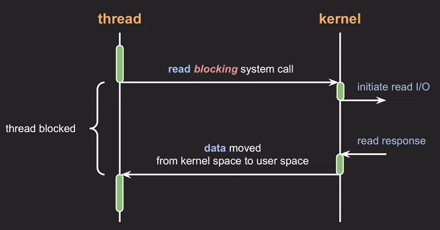
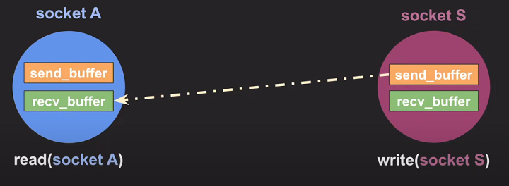
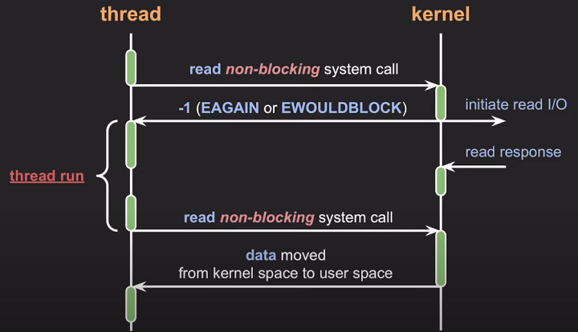
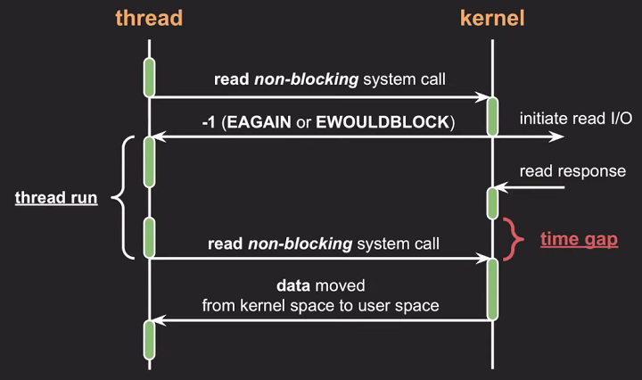
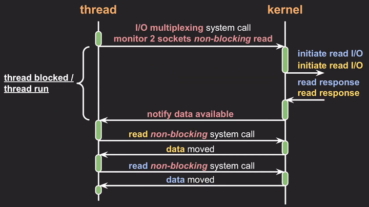
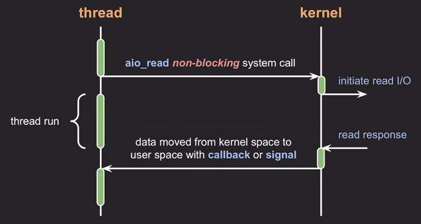
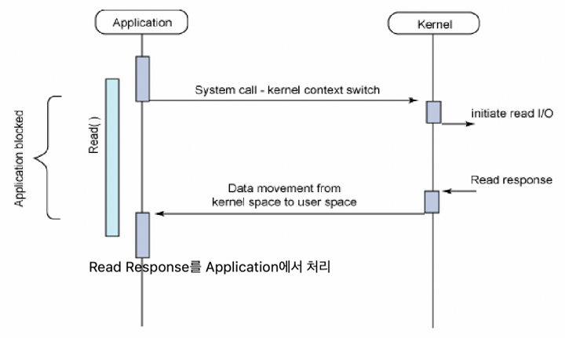
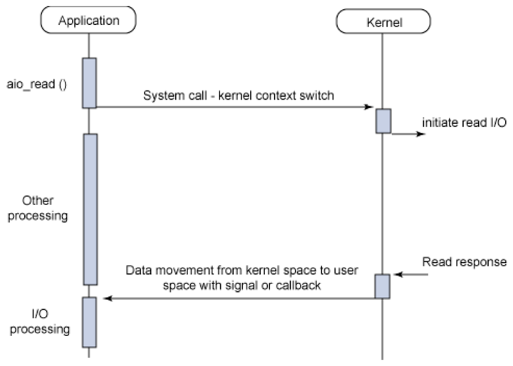
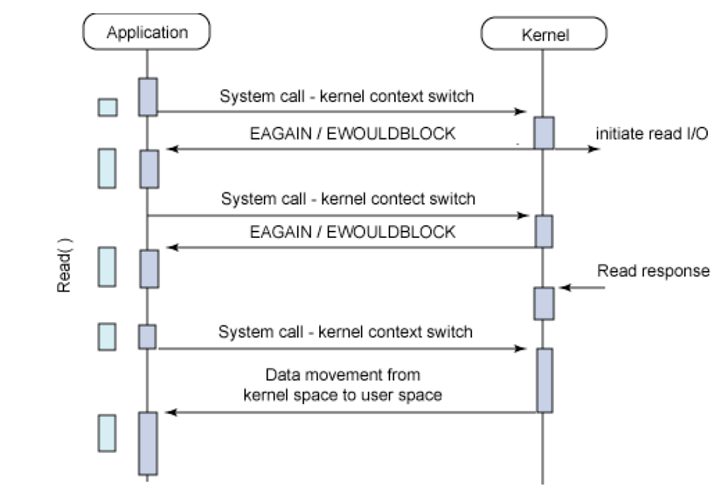
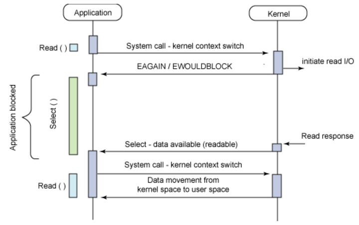

## Network I/O (socket 통신)에서의 Blocking I/O, Non-blocking I/O
### Block I/O 
* I/O 작업을 요청한 프로세스/스레드를 요청이 완료될 때까지 차단

* thread에서 read 라는 blocking system call을 호출하면 
* 해당 thread는 block 되고
* kerner에서는 read I/O 를 실행
* device에서 read response 를 받으면
* 요청한 data를 kerner space 에서 user space 로 전송
* thread의 block이 끝나고 다음 코드 실행 

* thread에서 read 라는 system call을 socket A에서 호출하면
* socket A의 recv_buffer에 데이터가 들어올 때까지, 해당 thread는 block 된다
* thread에서 write 라는 system call을 socket S에서 호출할 때
* 만약 socket S의 send_buffer가 가득찬 경우, send_buffer가 빌 때까지 해당 thread는 block 된다

### Non-block I/O
* I/O 작업을 요청한 프로세스/쓰레드를 차단하지 않고, 요청에 대한 현재 상태를 즉시 리턴

* thread에서 read 라는 non-blocking system call을 호출하면
* kerner에서는 read I/O를 실행 후
* EAGAIN 또는 EWOULDBLOCK 이라는 응답을 바로 리턴
* 해당 thread는 block 되지 않고, 다음 코드 실행 가능
* device에서 read response를 받아온 뒤
* 다음 번 read system call이 호출되면
* 요청한 data를 kerner space 에서 user space 로 전송

* thread에서 read 라는 system call을 socket A에서 호출했을 때
* socket A의 recv_buffer에 데이터가 비었더라도 해당 thread는 block 되지 않고 다른 작업 가능
* thread에서 write 라는 system call을 socket S에서 호출할 때
* 만약 socket S의 send_buffer가 가득차더라도 해당 thread는 block 된지 않고 다른 작업 가능

## Non-block I/O 결과 처리 방식
### 1. Non-block I/O가 완료됐는지 결과를 주기적으로 확인

* 완료된 시간과 완료 확인 시간 사이의 **time gap으로 인해 처리속도가 느림**  
* 완료를 반복적으로 확인하여 CPU 낭비

### **2. I/O multiplexing**

* 관심있는 I/O 작업들을 동시에 모니터링하여
* 그 중 완료된 I/O 작업들을 한번에 알려줌
* I/O multiplexing의 종류
  * epoll (Linux)
  * kqueue (MAC)
  * IOCP (Window)
* **네트워크 통신에 많이 사용**
* 다중 클라이언트와의 상호작용이 필요한 서버에 유용
* 단일 쓰레드에서 다중 클라이언트와의 I/O를 효율적으로 처리 가능

### 3. Callback / signal 사용

* 디바이스로부터 read response가 오면
* 요청한 data를 callback 또는 signal을 통해서 kernel space 에서 user space로 처리
* Asynchronous I/O 사용
  * POSIX AIO (Unix)
  * LINUX AIO (Linux)

---

## Blocking + Synchronous

## Non-blocking + Asynchronous

## Non-blocking + Synchronous

## Blocking + Asynchronous

[참고](https://www.youtube.com/watch?v=mb-QHxVfmcs&t=305s)